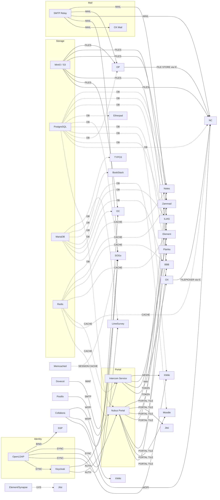

<!--
SPDX-FileCopyrightText: 2026 openDesk Edu Contributors
SPDX-License-Identifier: Apache-2.0
-->

# Service Interconnection Matrix

Maps runtime dependencies, data flows, and shared infrastructure between services.
A cell contains the relationship type; empty means no direct interaction.

## Legend

- **AUTH** — Uses service for authentication
- **DATA** — Reads/writes data to/from service
- **TOKEN** — Obtains auth token via silent login (Intercom)
- **DELEGATE** — Delegates functionality to service
- **MAIL** — Sends/receives mail through service
- **IMAP** — Reads mail via IMAP protocol
- **LDAP** — Reads/writes LDAP directory entries
- **SHARED** — Shares infrastructure dependency (DB, cache, storage)

## Matrix

| | KC | NC | OC | OX | SG | EL | NB | OP | XW | IL | MD | BB | EP | BS | PK | ZM | LS | SP | CP | DI | EX | T3 | NT | JT | DP |
|---|---|---|---|---|---|---|---|---|---|---|---|---|---|---|---|---|---|---|---|---|---|---|---|---|---|---|
| **Keycloak** | — | AUTH | AUTH | AUTH | AUTH | AUTH | AUTH | AUTH | AUTH | AUTH | AUTH | AUTH | AUTH | AUTH | AUTH | AUTH | AUTH | AUTH | — | — | — | AUTH | AUTH | AUTH | — |
| **Nextcloud** | | — | DATA | DATA | DATA | DATA | PORTAL | DATA | NEWS | DATA | | | | | | | | | FILE | | | | |
| **OpenCloud** | | | — | DATA | DATA | | PORTAL | | | | | | | | | | | | | | | | |
| **OX AppSuite** | | | | — | DELEGATE | | PORTAL | DATA | NEWS | | | | | | | | | | | | | | | MAIL | |
| **SOGo** | | | | | — | | PORTAL | | | | | | | | | | | LDAP | | | | | | | IMAP|MAIL | |

| **Element** | | | | | | — | TOKEN | | | | | | | | | | | | | | | | | UVS |
| **Nubus** | | | | | | | — | | | | | | | | | | | | | | | | | |
| **OpenProject** | | DATA | | | | | | — | | | | | | | | | | | | | | | |
| **XWiki** | | NEWS | | | | | | | — | | | | | | | | LDAP | | | | | |
| **ILIAS** | | | | | | | PORTAL | | | — | | | | | | | | | | | | | | |
| **Moodle** | | | | | | | PORTAL | | | | — | | | | | | | | | | | | | |
| **BBB** | | | | | | | PORTAL | | | | | — | | | | | | | | | | | |
| **Etherpad** | | | | | | | PORTAL | | | | | | — | | | | | | | | | | |
| **BookStack** | | | | | | | PORTAL | | | | | | | — | | | | | | | | | |
| **Planka** | | | | | | | PORTAL | | | | | | | | — | | | | | | | | |
| **Zammad** | | | | | | MAIL | PORTAL | | | | | | | | | — | | | | | | | | | | MAIL | MAIL |
| **LimeSurvey** | | | | | | | PORTAL | | | | | | | | | | — | LDAP | | | | | | | | | | |
| **SSP** | | | | | | | | | | | | | | | | | | LDAP | — | | | | |
| **Collabora** | | DELEGATE | WOPI | | | | | | WOPI | | | | | | | | | | | — | | | |
| **CryptPad** | | | | | | | PORTAL | | | | | | | | | | | | | | — | | |
| **Draw.io** | | | | | | | PORTAL | | | | | | | | | | | | | | | — | |
| **Excalidraw** | | | | | | | PORTAL | | | | | | | | | | | | | | | | — | |
| **TYPO3** | | | | | | | PORTAL | | | | | | | | | | | | | | | | — | |
| **Notes** | | | | | | | PORTAL | | | | | | | | | | | | | | | | | — | |
| **Jitsi** | | | | | | | PORTAL | | | | | | | | | | | | | | | | | | — | |
| **Dovecot-Postfix** | | | | | | MAIL | | | | | | | | | | | | | | | | | | | | | | MAIL | IMAP | — |

## Shared Infrastructure

### PostgreSQL (single cluster, multiple databases)

Services sharing the PostgreSQL instance: Nubus, Nextcloud, Element, OpenProject, XWiki, BigBlueButton, Etherpad, Planka, Zammad, Notes, SOGo

If the PostgreSQL cluster fails, ALL 11 services lose database connectivity simultaneously.

### MariaDB (single cluster, multiple databases)

Services sharing the MariaDB instance: Nextcloud, OpenCloud, OX AppSuite, BookStack, LimeSurvey, TYPO3, ILIAS (Galera), Moodle (external)

### Redis (single cluster)

Services sharing the Redis instance: Nubus, Nextcloud, Element, Intercom Service, BigBlueButton, Zammad, Notes

If Redis fails: auth caching, session management, and intercom token caching break across 6 services.

### Memcached (session caching)

SOGo uses Memcached (NOT Redis) for session caching. Memcached is NOT shared with other services.

### MinIO / S3

Shared buckets used by: Nextcloud (primary), OpenCloud (WebDAV/S3), Element (media), Notes (attachments), ILIAS (course files), OpenProject (project files)

### Keycloak (OIDC/SAML IdP)

All 20 authenticated services depend on Keycloak. If Keycloak is unavailable:
- No new logins succeed
- Existing sessions remain valid until token expiry
- Silent login (Intercom) fails → cross-app workflows break

### SMTP/IMAP (mail relay and delivery)

Services sending mail: OX AppSuite, SOGo, Nextcloud, OpenProject, Zammad
Services receiving mail: SOGo (via Dovecot IMAP + Postfix SMTP)
Services acting as mail relay: Dovecot-Postfix (for SOGo)

## Single Points of Failure

| Component | Impact Scope | Services Affected |
|-----------|-------------|-------------------|
| Keycloak | All authentication | 20 services |
| PostgreSQL | All PG-backed services | 11 services |
| MariaDB | All MariaDB-backed services | 8 services |
| Redis | Caching + session | 7 services |
| MinIO | File storage | 6 services |
| HAProxy Ingress | All external access | All services |
| Cert Manager | TLS termination | All services |
| Intercom Service | Cross-app SSO | OX, Nextcloud, Element |
| Matrix UVS | Jitsi auth verification | Jitsi, Element |
| Dovecot-Postfix | Mail delivery/retention | SOGo |

## Interconnection Diagram

